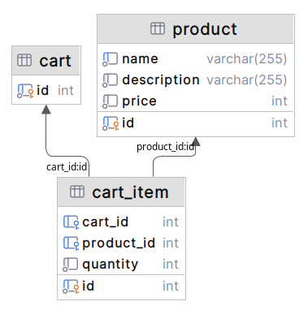

## Cart API with Symfony 6 

## Install:
* Run 'docker-compose up -d --build'
* Run 'docker-compose exec php bin/setup_db.sh' to load fixtures

## API DOC
* You can go to http://localhost:8080/api/doc and try the shop api  

## Data Base Design

## Data
* [cart](src%2FDataFixtures%2FResources%2Fcart.csv)
* [cart_item](src%2FDataFixtures%2FResources%2Fcart_item.csv)
* [product](src%2FDataFixtures%2FResources%2Fproduct.csv)

## Test
* Run 'docker-compose exec php make all'
